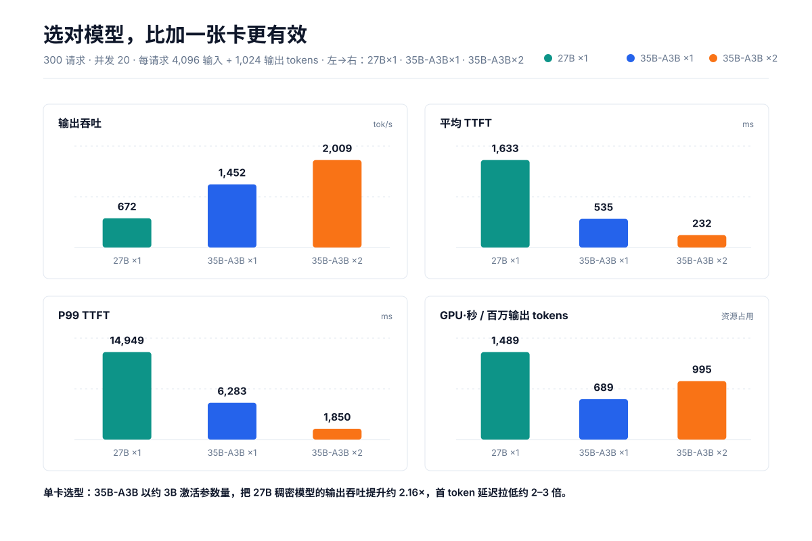

# 一张卡还是两张卡，还是先选对模型？Qwen3.6-35B-A3B（MoE）与 Qwen3.8-27B（稠密）在 RTX PRO 6000 上的 vLLM 高并发实测

> 300 个请求、并发上限 20、每请求 4K 输入 + 1K 输出。我们测了三种配置：**27B 稠密×1 卡、35B-A3B×1 卡、35B-A3B×2 卡**。结论分两层：在**同一张单卡**上，3B 激活的 35B-A3B 把 27B 稠密模型的输出吞吐提升 **2.16×**，首 token 延迟拉低约 2–3 倍；而在 **35B-A3B** 内部，第二张卡只带来 **1.384×** 加速、把 P99 TTFT 从 6.28 秒压到 1.85 秒，却没有线性扩展。

## 摘要

这组测试回答的是两个在真实服务决策里经常纠缠在一起的问题：**我该选哪个模型？我又该用几张卡？**

我们固定了 300 个请求、20 路并发、每请求 4K 输入 + 1K 输出，跑了三个组合：

| 配置 | 输出吞吐 | 平均 TTFT | P99 TTFT | 完成时间 |
|---|---:|---:|---:|---:|
| `qwen3.8-27b-fp8` ×1 | 671.77 tok/s | 1,632.93 ms | 14,949.43 ms | 457.30 s |
| `qwen3.6-35b-a3b-fp8` ×1 | 1,451.64 tok/s | 535.12 ms | 6,282.80 ms | 211.62 s |
| `qwen3.6-35b-a3b-fp8` ×2 | 2,009.36 tok/s | 231.77 ms | 1,849.99 ms | 152.88 s |

第一个发现往往被忽略：**在只有一张卡的前提下，模型选择带来的差异远大于卡数的差异。** 同为单卡，3B 激活的 35B-A3B（总参数 35B、激活 3B 的稀疏 MoE）把 27B 稠密模型甩开：输出吞吐 **2.16×**，平均 TTFT **−67.2%**，P99 TTFT **−58.0%**，平均 TPOT **−53.2%**。也就是说，如果你只有一张 RTX PRO 6000，与其纠结要不要加卡，不如先把模型换成激活参数更少的稀疏架构。

第二个发现是加卡的代价：在 35B-A3B 内部，第二张卡把输出吞吐提升 38.4%，完成时间缩短 27.8%，P99 TTFT 降低 70.6%，但双卡并行效率只有 **69.2%**，每百万输出 token 的 GPU 时间反而增加约 **44.5%**。这不值“翻倍”，但在意首 token 长尾和固定时间窗口容量时，它买来的正是这两样。




## 1. 实验设置

| 项目 | 设置 |
|---|---:|
| 推理框架 | vLLM |
| GPU | RTX PRO 6000 |
| 成功请求 | 300 / 300 / 300 |
| 失败请求 | 0 / 0 / 0 |
| 最大请求并发 | 20 |
| 单请求输入长度 | 4,096 tokens（由总量 ÷ 请求数推得） |
| 单请求输出长度 | 1,024 tokens（由总量 ÷ 请求数推得） |
| 总输入 / 输出 | 1,228,800 / 307,200 tokens |
| 投机解码 | 开启；每次 draft 2 tokens（由 draft tokens ÷ drafts 推得） |

被测模型与卡数：

| 配置 | 模型标识 | 卡数 |
|---|---|---:|
| 27B ×1 | `qwen3.8-27b-fp8` | 1 |
| 35B ×1 | `qwen3.6-35b-a3b-fp8` | 1 |
| 35B ×2 | `qwen3.6-35b-a3b-fp8` | 2 |

关于“A3B”：`qwen3.6-35b-a3b-fp8` 是 3B 激活的稀疏 MoE（总参数约 35B、每 token 激活约 3B）；`qwen3.8-27b-fp8` 是稠密模型（约 27B 全量参数）。二者是明确不同的架构，但并非同规模受控对照：本实验未附带模型卡、draft model 与采样参数，因此**跨模型的 2.16× 差异不能简单归因于“MoE 更优”**，而应理解为“都只用一张卡时，激活参数量更少的架构在此负载下更快”。

三次测试的请求数、token 总量和配置并发一致，因而可以横向比较。但当前记录没有包含 vLLM 版本、命令行参数、双卡并行策略（例如张量并行或数据并行）、draft model/方法、采样参数、GPU 功耗与频率、互联方式、预热过程及重复试验。本文因此把结论限定为**这几组运行的观测对比**，不把所有差异简单因果归结为“换模型”或“加了一张卡”。

## 2. 核心结果

| 指标 | 27B ×1 | 35B-A3B ×1 | 35B-A3B ×2 |
|---|---:|---:|---:|
| 完成时间 | 457.30 s | 211.62 s | 152.88 s |
| 请求吞吐 | 0.66 req/s | 1.42 req/s | 1.96 req/s |
| 输出吞吐 | 671.77 tok/s | 1,451.64 tok/s | 2,009.36 tok/s |
| 总 token 吞吐 | 3,358.83 tok/s | 7,258.20 tok/s | 10,046.81 tok/s |
| 平均 TTFT | 1,632.93 ms | 535.12 ms | 231.77 ms |
| 中位 TTFT | 843.16 ms | 179.66 ms | 153.70 ms |
| P99 TTFT | 14,949.43 ms | 6,282.80 ms | 1,849.99 ms |
| 平均 TPOT | 27.84 ms | 13.02 ms | 9.52 ms |
| 中位 TPOT | 25.90 ms | 12.41 ms | 9.20 ms |
| P99 TPOT | 64.35 ms | 27.82 ms | 20.32 ms |
| 平均 ITL | 69.35 ms | 31.04 ms | 23.28 ms |
| 中位 ITL | 38.73 ms | 27.12 ms | 19.25 ms |
| P99 ITL | 765.14 ms | 123.88 ms | 115.87 ms |
| 投机接受率 | 74.65% | 69.28% | 72.35% |
| 平均接受长度 | 2.49 | 2.39 | 2.45 |


## 3. 更值得注意的发现：同样是单卡，选对模型比加卡更有效

如果只看“35B 单卡 vs 双卡”，结论会退化成“加卡能提速但不线性”。但一旦把 **27B 稠密单卡** 也放进来，就会发现一个更基本的事实：**在单卡上，模型本身的差异远大于卡数的差异。**

| 指标 | 27B ×1 | 35B-A3B ×1 | 35B-A3B ×1 相对 27B |
|---|---:|---:|---:|
| 输出吞吐 | 671.77 tok/s | 1,451.64 tok/s | **+116.1%**（2.16×） |
| 请求吞吐 | 0.66 req/s | 1.42 req/s | **+115.2%**（2.15×） |
| 完成时间 | 457.30 s | 211.62 s | **−53.7%** |
| 平均 TTFT | 1,632.93 ms | 535.12 ms | **−67.2%** |
| 中位 TTFT | 843.16 ms | 179.66 ms | **−78.7%** |
| P99 TTFT | 14,949.43 ms | 6,282.80 ms | **−58.0%** |
| 平均 TPOT | 27.84 ms | 13.02 ms | **−53.2%** |
| P99 TPOT | 64.35 ms | 27.82 ms | **−56.8%** |
| 平均 ITL | 69.35 ms | 31.04 ms | **−55.2%** |
| P99 ITL | 765.14 ms | 123.88 ms | **−83.8%** |

这里能看到两层含义：

1. **稀疏激活带来的单卡收益非常可观。** 35B 的总参数量比 27B 更大，但每 token 只激活约 3B 参数，于是内存带宽与计算量显著下降。单卡上它把 27B 的输出吞吐提升约 2.16×，同时把平均 TTFT 压到 1/3、把平均 TPOT 压到约一半，几乎全面占优。
2. **加卡的收益反而更小。** 即便是把 27B 单卡（457.30 s）换成 35B-A3B 单卡（211.62 s），完成时间就已缩短 53.7%、输出吞吐翻倍；而给 35B 再加一张卡（×2），相比单卡只再缩短 27.8%。**在部分场景里，换对模型比加一张卡更能解决问题。**

需要说明的是，这是一次**跨模型**的单点观测，不是受控消融。27B 与 35B 在总参数量、量化位宽、draft model、调度细节上都不同，2.16× 不能简单归因于“MoE 更好”。但它足以说明：当预算只够一张卡时，**激活参数量（而不是总参数量）往往才是单卡吞吐与延迟的主导变量**，选型时应优先关注这一点。


## 4. 35B-A3B：单卡 vs 双卡

现在把范围收回到同一个模型，回答最初的问题：第二张 RTX PRO 6000 值不值。

### 4.1 双卡最值钱的收益：首 token 长尾

P99 TTFT 从 6,282.80 ms 降到 1,849.99 ms，降低约 4.43 秒。均值也从 535.12 ms 降到 231.77 ms，而中位数只从 179.66 ms 降到 153.70 ms。这种“均值和中位数改善温和、P99 改善剧烈”的形态，说明双卡主要买走的是高并发下的排队与调度长尾，而不是让每个请求都更快。

如果线上目标是 **P99 TTFT**，这一项比“+38.4% tok/s”更有决策价值。

### 4.2 解码阶段稳定提速，但 ITL 尾部仍在

平均 TPOT 从 13.02 ms 降到 9.52 ms，P99 从 27.82 ms 降到 20.32 ms，都改善约 27%，说明解码阶段收益较为一致；平均 ITL 改善 25.0%，但 P99 ITL 仍为 115.87 ms（仅改善 6.5%）。也就是说，双卡显著降低了常态 token 间隔，却没有等比例消除偶发的长间隔。对流式输出的“停顿感”敏感的场景，仍需关注调度、批处理、CPU 提交与网络输出抖动。

### 4.3 端到端时间与请求吞吐能够互相印证

由于每个请求固定生成 1,024 tokens，可用下式近似单请求生成时间：

```text
估算生成时间 ≈ TTFT + (输出 tokens − 1) × TPOT
```

| 配置 | 估算生成时间 | 由吞吐反推（并发 / req 吞吐） |
|---|---:|---:|
| 27B ×1 | 30.11 s | 20 / 0.66 ≈ 30.30 s |
| 35B-A3B ×1 | 13.85 s | 20 / 1.42 ≈ 14.08 s |
| 35B-A3B ×2 | 9.97 s | 20 / 1.96 ≈ 10.20 s |

三组估算都与各自的请求吞吐反推值基本吻合。这是一次有用的交叉校验：TTFT、TPOT、请求吞吐和总时长在整体上是自洽的，说明这些指标不是相互矛盾的独立口径。


## 5. 扩展效率与成本视角


把范围仍限定在 35B-A3B，双卡输出吞吐相对单卡的加速比为：

```text
speedup = 2,009.36 / 1,451.64 = 1.384×
parallel efficiency = 1.384 / 2 = 69.2%
```

69.2% 不是“第二张卡的利用率”，而是相对于理想 2× 加速的整体并行效率。非线性扩展可能来自跨卡通信、同步、内存访问、batch 形态、调度或投机解码行为变化；在缺少并行策略和 profiler 数据时，不能进一步归因。

另一个更直接的成本代理是每 100 万输出 token 消耗的 GPU 时间：

| 配置 | GPU·秒 / 100 万输出 tokens | 相对 27B ×1 |
|---|---:|---:|
| 27B ×1 | 1,488.6 | 1.00× |
| 35B-A3B ×1 | 688.9 | 0.46× |
| 35B-A3B ×2 | 995.3 | 0.67× |

这里没有纳入功耗、电价和折旧，只是按 GPU 数量 × 测试时长计算的资源占用。即便如此，它已经说明两个事实：

- **单位算力产出最高的，是 35B-A3B 单卡**，每百万输出 token 只用约 689 GPU·秒，几乎只有 27B 单卡的一半；
- **给 35B 加第二张卡，单位产出反而上升**（995 GPU·秒，比单卡的 689 增加 44.5%），说明扩容买来的是容量和尾延迟，而不是更低的每 token 成本。

若目标是**最大化单卡产出**，35B-A3B 单卡是最经济的；若目标是**压低尾延迟**或在更短时间内完成同一批任务，35B-A3B 双卡更合适；而 27B 单卡在吞吐和成本上都不占优。

## 6. 投机解码：接受率随配置略有波动


三组运行的接受率与接受长度都有小幅波动：

| 配置 | 总体接受率 | 平均接受长度 | Position 0 | Position 1 |
|---|---:|---:|---:|---:|
| 27B ×1 | 74.65% | 2.49 | 79.20% | 70.11% |
| 35B-A3B ×1 | 69.28% | 2.39 | 75.16% | 63.40% |
| 35B-A3B ×2 | 72.35% | 2.45 | 78.48% | 66.23% |

27B 的接受率反而最高（74.65%）。但接受率并不能直接解释吞吐差异，因为不同模型的 draft/target 行为、请求调度与 batch 组合都可能改变接受统计；而且接受率衡量的是“draft 是否被接受”，与模型的绝对速度无关。要隔离其贡献，应在相同 seed 与请求序列下重复运行，并增加**关闭投机解码**的对照组。

## 7. 两个需要谨慎解读的字段

原始输出中有两处统计口径看起来并不直观：

1. 配置的 `Maximum request concurrency` 为 20，但 `Peak concurrent requests` 分别为 26 / 25 / 24。如果前者表示执行并发、后者包含排队或其他请求态，这可能成立；否则需要核查 benchmark 工具的定义或版本。
2. `Peak output token throughput` 分别为 780 / 1,100 / 520 tok/s，反而低于全程平均输出吞吐（1,451.64 / 2,009.36 / 671.77 tok/s）。二者显然不是同一时间窗口或同一聚合口径下可直接比较的“峰值”和“平均值”。

因此，本报告没有用这两个字段计算扩展效率。发布时建议补充 benchmark 工具名称、版本、统计窗口与对应源码链接，避免读者误把不同口径的数字放在一起比较。

## 8. 如何选择

**如果你是单卡预算，先选模型：**

- 选 `qwen3.6-35b-a3b-fp8`（激活参数更少的稀疏 MoE），而不是 `qwen3.8-27b-fp8`——单卡上 35B-A3B 的输出吞吐高出约 2.16×，首 token 延迟低约 2–3 倍；
- 27B 单卡的 P99 TTFT 高达约 15 秒，在并发 20 下几乎不具备可接受的交互体验，除非你明确要更小的模型 footprint。

**如果你已确定用 35B-A3B，再决定卡数：**

- **单卡**，如果你更关心每张 GPU 的产出或单位资源成本，且 1,452 tok/s 已满足容量；
- **双卡**，如果你有明确的 P99 TTFT SLO、需要约 2,000 tok/s 的输出容量或约 1.96 req/s 的固定 4K→1K 服务率，且更在意批任务完成时间。

本次对比的浓缩结论是：**单卡上，模型选择（激活参数量）带来的收益大于加卡；加第二张卡的价值不在“翻倍”，而在吞吐增加约四成、并显著收敛首 token 长尾。**

## 9. 下一轮实验建议

为了把这份观测报告升级为可用于容量规划的 benchmark，建议保持请求集固定并补充：

1. **并发扫描**：1、4、8、12、16、20、24、32，画出 throughput–TTFT Pareto 曲线；
2. **重复试验**：每个点至少 5 次，报告中位数与置信区间，而不是单次运行；
3. **同规模模型对照**：补充总参数量相近、激活参数量不同的模型（如同规模稠密 vs 稀疏），把“激活参数量更少更省”从观测升级为受控结论；
4. **并行策略对照**：明确 TP/DP 配置及 GPU 互联，区分“模型切分”和“副本扩容”；
5. **投机解码消融**：相同请求顺序下比较 on/off，记录接受率与实际加速；
6. **长度矩阵**：至少覆盖 1K→256、4K→1K、16K→1K，区分 prefill 与 decode 瓶颈；
7. **系统指标**：记录 GPU 利用率、显存、功耗、CPU、跨卡通信与 prefix cache 命中；
8. **版本与命令**：固化 vLLM/驱动/CUDA 版本、完整启动参数、benchmark 命令与 seed。

## 10. 结论

在这组 4K 输入、1K 输出、并发 20 的固定负载下，我们对比了三个组合，得到两层结论：

1. **单卡上，选对模型 > 加卡。** `qwen3.6-35b-a3b-fp8`（约 3B 激活参数）在单卡上把 `qwen3.8-27b-fp8` 稠密模型（约 27B 全量参数）的输出吞吐提升到 2.16×，完成时间缩短 53.7%，平均 TTFT 降低 67.2%，P99 TTFT 降低 58.0%。这说明在预算有限时，**激活参数量往往是单卡吞吐与延迟的主导变量**。
2. **加卡买来的是容量与尾延迟，不是线性扩展。** 在 35B-A3B 内部，双卡将输出吞吐提升 38.4%、缩短完成时间 27.8%、把 P99 TTFT 降低 70.6%，但并行效率约 69.2%，每百万输出 token 的 GPU 时间增加 44.5%。

如果你在优化交互式服务，优先选择激活参数更少的稀疏模型；如果你已确定模型、需要更大容量或更稳的 P99，再加卡。而在这组数据里，**27B 稠密单卡无论是吞吐、延迟还是单位算力成本，都处在明显劣势**——这正是“选对模型”这一次要强调的点。

---

### 计算说明

- 百分比变化：`(新 − 旧) / 旧`
- 模型对比（同为单卡）：以 27B ×1 为基准，`(35B-A3B ×1 − 27B ×1) / 27B ×1`
- 卡数对比（同为 35B-A3B）：以 35B ×1 为基准，`(35B ×2 − 35B ×1) / 35B ×1`
- 输出吞吐加速（双卡）：`2,009.36 / 1,451.64 = 1.3842×`
- 并行效率：`1.3842 / 2 = 69.21%`
- GPU·秒 / 百万输出 token：`GPU 数 × 时长 / 307,200 × 1,000,000`
- 估算生成时间：`TTFT_mean/1000 + (1024 − 1) × TPOT_mean/1000`
- 所有派生值由 `scripts/generate_charts.py` 从 `data/benchmark.csv` 计算；展示值按可读性四舍五入。
