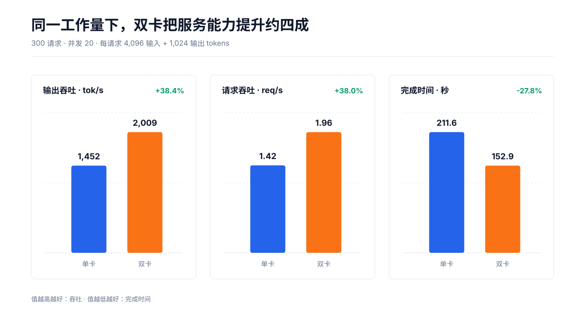
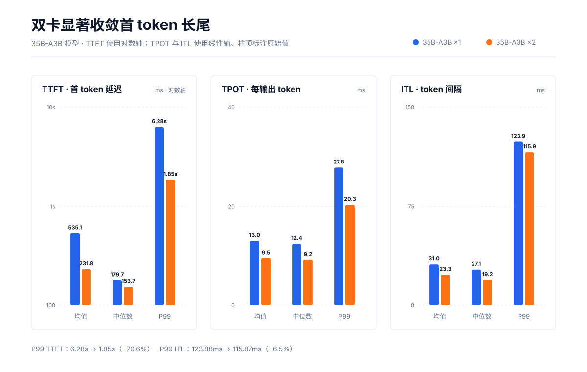
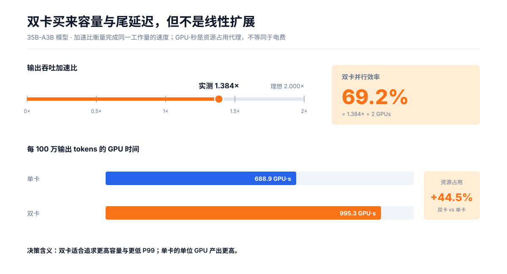
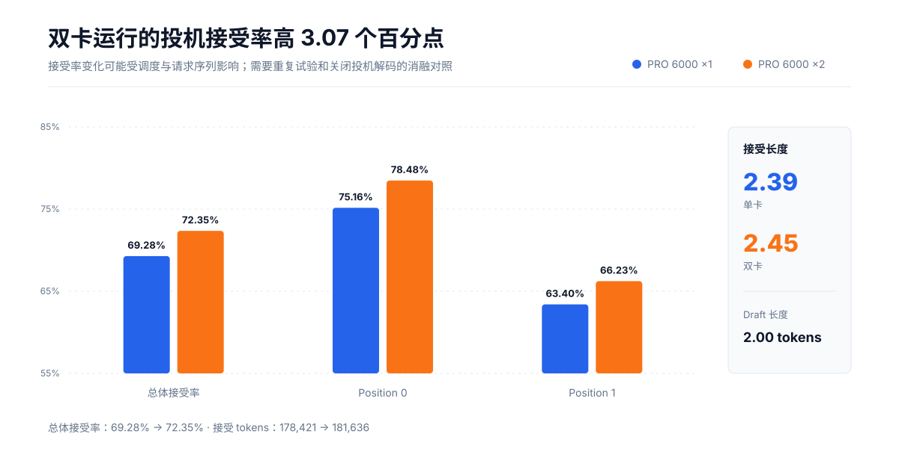

# 一张卡还是两张卡？Qwen3.6-35B-A3B-FP8 在 RTX PRO 6000 上的 vLLM 高并发实测

> 300 个请求、并发上限 20、每请求 4K 输入 + 1K 输出。双卡带来 **1.384× 输出吞吐**，把 **P99 首 token 延迟从 6.28 秒压到 1.85 秒**；但它没有带来线性加速，单位输出 token 的 GPU 时间反而增加约 **44.5%**。

## 摘要

这组测试回答的是一个很实际的问题：运行 Qwen3.6-35B-A3B-FP8 时，第二张 RTX PRO 6000 究竟买来了什么？

答案并不是简单的“快一倍”。双卡将测试完成时间从 211.62 秒缩短到 152.88 秒，输出吞吐提升 38.4%，请求吞吐提升 38.0%。更显著的收益来自延迟：平均 TTFT 降低 56.7%，P99 TTFT 降低 70.6%，TPOT 的均值和 P99 都下降约 27%。对于有首 token SLO、对长尾敏感或希望在固定时间窗口内服务更多请求的系统，双卡优势明确。

但从资源效率看，双卡并不占优。输出吞吐的双卡并行效率为 69.2%；处理 100 万输出 token 所需的 GPU 时间从约 689 GPU·秒增加到约 995 GPU·秒。也就是说，这次双卡扩容更像是用额外算力换取容量和更稳定的尾延迟，而不是降低每 token 成本。



## 1. 实验设置

| 项目 | 设置 |
|---|---:|
| 模型标识 | `qwen3.6-35b-a3b-fp8` |
| 推理框架 | vLLM |
| GPU 配置 | RTX PRO 6000 ×1 / ×2 |
| 成功请求 | 300 / 300 |
| 失败请求 | 0 / 0 |
| 最大请求并发 | 20 |
| 单请求输入长度 | 4,096 tokens（由总量 ÷ 请求数推得） |
| 单请求输出长度 | 1,024 tokens（由总量 ÷ 请求数推得） |
| 总输入 / 输出 | 1,228,800 / 307,200 tokens |
| 投机解码 | 开启；每次 draft 2 tokens（由 draft tokens ÷ drafts 推得） |

两次测试的请求数、token 总量和配置并发一致，因而可以直接比较。但当前记录没有包含 vLLM 版本、命令行参数、双卡并行策略（例如张量并行或数据并行）、draft model/方法、采样参数、GPU 功耗与频率、互联方式、预热过程及重复试验。本文因此把结论限定为**这两次运行的观测对比**，不把所有差异都因果归结为“增加了一张 GPU”。

## 2. 核心结果

| 指标 | 单卡 | 双卡 | 双卡相对变化 |
|---|---:|---:|---:|
| 完成时间 | 211.62 s | 152.88 s | **−27.8%** |
| 请求吞吐 | 1.42 req/s | 1.96 req/s | **+38.0%** |
| 输出吞吐 | 1,451.64 tok/s | 2,009.36 tok/s | **+38.4%** |
| 总 token 吞吐 | 7,258.20 tok/s | 10,046.81 tok/s | **+38.4%** |
| 平均 TTFT | 535.12 ms | 231.77 ms | **−56.7%** |
| P99 TTFT | 6,282.80 ms | 1,849.99 ms | **−70.6%** |
| 平均 TPOT | 13.02 ms | 9.52 ms | **−26.9%** |
| P99 TPOT | 27.82 ms | 20.32 ms | **−27.0%** |
| 平均 ITL | 31.04 ms | 23.28 ms | **−25.0%** |
| P99 ITL | 123.88 ms | 115.87 ms | **−6.5%** |



### 2.1 双卡最值钱的收益：首 token 长尾

单卡平均 TTFT 为 535 ms，但中位数只有 180 ms，P99 却升至 6.28 秒。这种“中位数很快、极少数请求很慢”的形态，通常意味着高并发下存在明显的排队或调度长尾。双卡把 P99 压到 1.85 秒，降低 4.43 秒；同时均值降到 232 ms，而中位数只从 180 ms 降到 154 ms。

因此，双卡对典型请求的首 token 体验改善温和，对最慢 1% 请求的改善却非常大。如果线上目标是 P99 TTFT，而不是只看平均吞吐，这一项比“+38.4% tok/s”更有决策价值。

### 2.2 解码阶段稳定提速，但 ITL 尾部仍在

双卡平均 TPOT 从 13.02 ms 降至 9.52 ms，P99 从 27.82 ms 降至 20.32 ms，二者都改善约 27%，说明解码阶段的收益较为一致。

ITL 的均值和中位数分别改善 25.0% 与 29.0%，但 P99 只改善 6.5%，仍为 115.87 ms。换句话说，双卡显著降低了常态 token 间隔，却没有等比例消除偶发的长间隔。若流式输出对“停顿感”敏感，后续应继续检查调度、批处理、CPU 提交、网络输出与运行时抖动。

### 2.3 端到端时间与请求吞吐能够互相印证

由于每个请求固定生成 1,024 tokens，可以用下面的近似式估算单请求生成时间：

```text
估算生成时间 ≈ TTFT + (输出 tokens − 1) × TPOT
```

- 单卡：`0.535 + 1,023 × 0.01302 ≈ 13.85 s`
- 双卡：`0.232 + 1,023 × 0.00952 ≈ 9.97 s`

估算值下降约 28.0%，与总完成时间下降 27.8% 很接近；在并发 20 下，对应的服务率也与实测 1.42 / 1.96 req/s 基本一致。这是一次有用的交叉校验：TTFT、TPOT、请求吞吐和总时长在整体上相互自洽。

## 3. 扩展效率与成本视角



双卡输出吞吐相对单卡的加速比为：

```text
speedup = 2,009.36 / 1,451.64 = 1.384×
parallel efficiency = 1.384 / 2 = 69.2%
```

69.2% 不是“第二张卡的利用率”，而是相对于理想 2× 加速的整体并行效率。非线性扩展可能来自跨卡通信、同步、内存访问、batch 形态、调度或投机解码行为变化；在缺少并行策略和 profiler 数据时，不能进一步归因。

另一个更直接的成本代理是每 100 万输出 token 消耗的 GPU 时间：

| 配置 | GPU·秒 / 100 万输出 tokens | 相对单卡 |
|---|---:|---:|
| 单卡 | 688.9 | 1.00× |
| 双卡 | 995.3 | 1.445× |

这里没有纳入功耗、电价和折旧，只是按 GPU 数量 × 测试时长计算的资源占用。即便如此，它已经说明：若目标是最大化单卡产出，单卡更经济；若目标是压低尾延迟或在更短时间内完成同一批任务，双卡更合适。

## 4. 投机解码：接受率略有提高



双卡运行的总体接受率从 69.28% 提升到 72.35%，增加 3.07 个百分点；平均接受长度从 2.39 提升到 2.45。位置 0 和位置 1 的接受率也分别提高 3.32 和 2.83 个百分点。

这个变化方向有利于吞吐，但不能直接解释为“双卡让投机解码更准确”。两次运行的请求调度、随机采样、batch 组合或 draft/target 执行节奏都可能改变接受统计。要隔离其贡献，应在相同 seed 与请求序列下重复运行，并增加关闭投机解码的对照组。

## 5. 两个需要谨慎解读的字段

原始输出中有两处统计口径看起来并不直观：

1. 配置的 `Maximum request concurrency` 为 20，但 `Peak concurrent requests` 分别为 26 和 25。如果前者表示执行并发、后者包含排队或其他请求态，这可能成立；否则需要核查 benchmark 工具的定义或版本。
2. `Peak output token throughput` 分别为 780 和 1,100 tok/s，反而低于全程平均输出吞吐 1,451.64 和 2,009.36 tok/s。二者显然不是同一时间窗口或同一聚合口径下可直接比较的“峰值”和“平均值”。

因此，本报告没有用这两个字段计算扩展效率。发布时建议补充 benchmark 工具名称、版本、统计窗口与对应源码链接，避免读者误把不同口径的数字放在一起比较。

## 6. 如何选择

**选择单卡，如果：**

- 更关心每张 GPU 的产出或单位资源成本；
- 1,452 tok/s 已满足容量；
- 可以接受并发 20 时偶发的高 TTFT，或愿意通过降低并发换取尾延迟。

**选择双卡，如果：**

- 有明确的 P99 TTFT SLO；
- 需要约 2,000 tok/s 输出容量或约 1.96 req/s 的固定 4K→1K 服务率；
- 更短的批任务完成时间比 GPU·秒成本更重要。

本次双卡的关键价值不是“速度翻倍”，而是**吞吐增加约四成，同时显著收敛首 token 长尾**。

## 7. 下一轮实验建议

为了把这份观测报告升级为可用于容量规划的 benchmark，建议保持请求集固定并补充：

1. **并发扫描**：1、4、8、12、16、20、24、32，画出 throughput–TTFT Pareto 曲线；
2. **重复试验**：每个点至少 5 次，报告中位数与置信区间，而不是单次运行；
3. **并行策略对照**：明确 TP/DP 配置及 GPU 互联，区分“模型切分”和“副本扩容”；
4. **投机解码消融**：相同请求顺序下比较 on/off，记录接受率与实际加速；
5. **长度矩阵**：至少覆盖 1K→256、4K→1K、16K→1K，区分 prefill 与 decode 瓶颈；
6. **系统指标**：记录 GPU 利用率、显存、功耗、CPU、跨卡通信与 prefix cache 命中；
7. **版本与命令**：固化 vLLM/驱动/CUDA 版本、完整启动参数、benchmark 命令与 seed。

## 8. 结论

在这组 4K 输入、1K 输出、并发 20 的固定负载下，RTX PRO 6000 ×2 将 Qwen3.6-35B-A3B-FP8 的输出吞吐提升 38.4%，测试时长缩短 27.8%，并把 P99 TTFT 降低 70.6%。这是一次明显改善服务质量的扩容，但不是线性扩展：整体并行效率约 69.2%，每百万输出 token 的 GPU 时间增加 44.5%。

如果你在优化交互式服务，双卡最重要的理由是 P99；如果你在优化离线吞吐成本，单卡仍是更高效的基线。

---

### 计算说明

- 百分比变化：`(双卡 − 单卡) / 单卡`
- 完成时间变化：`(152.88 − 211.62) / 211.62 = −27.76%`
- 输出吞吐加速：`2,009.36 / 1,451.64 = 1.3842×`
- 并行效率：`1.3842 / 2 = 69.21%`
- GPU·秒 / 百万输出 token：`GPU 数 × 时长 / 307,200 × 1,000,000`
- 所有派生值由 `scripts/generate_charts.py` 从 `data/benchmark.csv` 计算；展示值按可读性四舍五入。
